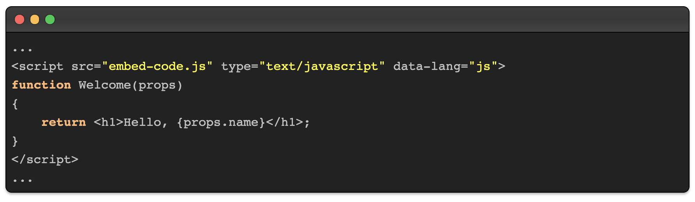
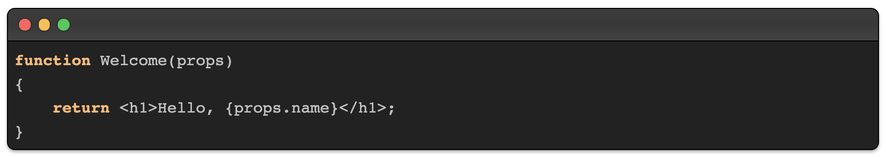

# embed-code

A tiny component to render code with [highlight.js](https://highlightjs.org/) inside of a terminal-like window.



## HOWTO

There are basically two ways of embedding the code. Both options will be using a simple JavaScript that is going to replace itself with the rendered code inside of a nice looking terminal window.

### 1. Plain text inside of the script tag 

```html
<script src="embed-code.js" type="text/javascript" data-lang="js">
function Welcome(props)
{
    return <h1>Hello, {props.name}</h1>;
}
</script>
```

### 2. JSON encoded data inside of the script tag 

```html
<script src="embed-code.js" type="text/javascript">
{"lang": "js", "code": "function Welcome(props)\n{\n    return <h1>Hello, {props.name}<\/h1>;\n}"}
</script>
```

The result will be looking like this:



## CDN

The latest `embed-code.js` is available from unpkg.com:

```diff
https://unpkg.com/embed-code@latest/embed-code.js
```

## WHY

I want to use this component in a Wordpress blog that's going to be filled from a github repository with markdown posts ...
